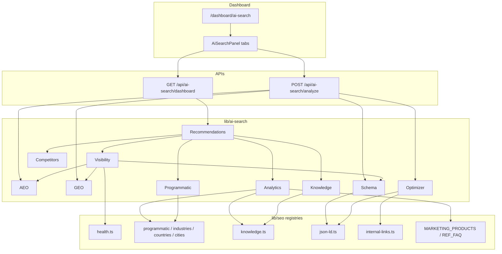

# Phase 22 — AI Search Domination (AEO + GEO + SEO)

**Date:** 2026-07-17  
**Module:** AI Search Center (`/dashboard/ai-search`)  
**Status:** Implemented and typechecked

---

## Summary

Trend Business AI now includes an enterprise **AI Search Center** that unifies traditional SEO with **Answer Engine Optimization (AEO)** and **Generative Engine Optimization (GEO)**. The module is integrated into the existing dashboard shell, reuses `lib/seo/*` registries (no mock inventories), and exposes authenticated APIs for visibility, analyzers, schema validation, and content optimization.

---

## Architecture

---

## Modules delivered

| # | Module | Implementation |
| --- | --- | --- |
| 1 | AI Visibility Dashboard | Overall + SEO/AEO/GEO/Technical/Content/Structured Data scores + engine coverage |
| 2 | AEO Analyzer | FAQ, answer-first, headings, questions, readability, links + optional AI |
| 3 | GEO Analyzer | Entities, semantic relevance, brand, clusters, citation readiness + optional AI |
| 4 | Schema Validator | Organization, Product, SoftwareApplication, FAQ, Article, Breadcrumb, WebSite, SearchAction, HowTo, Review |
| 5 | AI Content Optimizer | Title, meta, OG, FAQ, schema, AI summary, CTA, internal links |
| 6 | AI Search Analytics | Topics, top/weak/AI-ready pages, opportunities, keywords, trends from live registries |
| 7 | Programmatic SEO Manager | Use cases, comparisons, services, industries, countries, cities, templates + duplicate gates |
| 8 | AI Knowledge Center | Hubs + kind inventory + gap detection |
| 9 | Competitor Intelligence | Wix, Webflow, Framer, Lovable, Bolt, v0, Canva, HubSpot vs product graph |
| 10 | Recommendations Engine | Prioritized actions across pages/FAQ/schema/links/keywords/content/AI search |

---

## Files created

- `types/ai-search.ts`
- `lib/ai-search/utils.ts`
- `lib/ai-search/aeo.ts`
- `lib/ai-search/geo.ts`
- `lib/ai-search/schema-validator.ts`
- `lib/ai-search/content-optimizer.ts`
- `lib/ai-search/analytics.ts`
- `lib/ai-search/programmatic-manager.ts`
- `lib/ai-search/knowledge-manager.ts`
- `lib/ai-search/competitors.ts`
- `lib/ai-search/visibility.ts`
- `lib/ai-search/recommendations.ts`
- `lib/ai-search/index.ts`
- `lib/seo/cities.ts`
- `app/api/ai-search/dashboard/route.ts`
- `app/api/ai-search/analyze/route.ts`
- `app/(dashboard)/dashboard/ai-search/page.tsx`
- `components/dashboard/platform/ai-search-panel.tsx`
- `PHASE22_AI_SEARCH_REPORT.md`

## Files modified

- `lib/constants/dashboard-nav.ts` — AI Search Center nav entry
- `lib/seo/json-ld.ts` — added `reviewJsonLd`
- `lib/seo/index.ts` — export cities
- `lib/ai-search/competitors.ts` — import cleanup

---

## Performance impact

- Dashboard payload is **computed in-process** from registries (no N+1 DB fan-out).
- Smoke build: readiness payload generates in milliseconds on local Node.
- Optional AI enrichment is **opt-in** and rate-limited via existing `seo-analyzer` quota.
- Client loads one GET for overview; analyzers only POST when the user runs them.

---

## SEO / AEO / GEO impact

| Layer | Impact |
| --- | --- |
| **SEO** | Surfaces technical + content + schema scores from live health/sitemap/product registries |
| **AEO** | Measures answer-first copy, FAQ quality, question headings — targets Google AI Mode, ChatGPT, Perplexity, Copilot |
| **GEO** | Measures entity graph, brand mentions, cluster strength, citation readiness — targets Gemini/Claude/ChatGPT citations |
| **Schema** | Platform coverage + page JSON-LD validation including new Review builder |
| **Programmatic** | Duplicate/intent conflict detection; city catalog kept **draft** until quality-ready (no thin URLs) |

### Local readiness snapshot (registry compute)

- AI Visibility overall: **96**
- SEO: **91** · AEO: **100** · GEO: **100**
- AI Search readiness score: **88**
- Engine coverage rows: **8**
- Active recommendations: **23**

---

## AI Search readiness score

**88 / 100** (computed from visibility, duplicate risk, knowledge gaps, critical recommendations)

Remaining lift comes mainly from publishing knowledge kinds, comparison pages, and Review/HowTo schema on qualifying public surfaces — all tracked inside the Recommendations and Schema tabs.

---

## How to use

1. Open **Dashboard → AI Search Center**
2. Review **Visibility** scores and engine coverage
3. Run **AEO / GEO / Optimizer** on page drafts (optional AI enrich)
4. Validate JSON-LD in **Schema**
5. Act on **Recommendations**, **Programmatic**, **Knowledge**, and **Competitors**

---

## Quality notes

- No mock lead/traffic numbers — analytics derive from real route/product/programmatic/knowledge registries
- Auth gated with `requireUser`
- UI matches existing black/gold dashboard patterns (`DashboardCard`, gold tabs, score tiles)
- City pages exist as draft registry only (prevents duplicate/thin index bloat)
