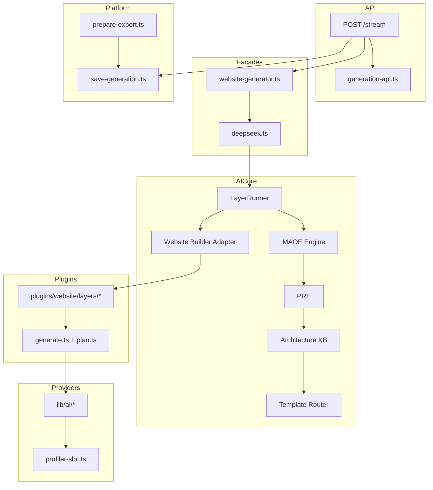

# Trend Business AI — Final Architecture Validation Report

**Date:** August 2, 2026  
**Scope:** Full-platform architecture audit (Phases 1–5)  
**Type:** Validation pass — not a refactor, not a performance optimization  

---

## Executive Summary

Trend Business AI has a **mature, production-viable architecture** centered on a single AI Core orchestration engine (`LayerRunner` + product adapters). The Website Builder — the platform's flagship product — runs through **one canonical generation path**. Phase 1 and Phase 2 orchestration migrations successfully removed legacy plugin wrappers (`websitePlugin`, `analyze.ts`, `validate.ts`, `export.ts`).

This pass identified **no critical architecture blockers** for production Website Builder generation. Minor inconsistencies were corrected without changing business behavior. Remaining issues are **structural debt** (bidirectional imports, validation layering, SEO module fragmentation) suitable for a future contracts-layer migration — not for this pass.

### Architecture Score: **82 / 100**

| Dimension | Score | Notes |
|-----------|-------|-------|
| Canonical execution path | 18/20 | Single pipeline; dual API surfaces (WB vs AI Core runs) intentional |
| Layer isolation | 14/20 | `ai-core` ↔ `lib/website` bidirectional imports remain |
| Dependency correctness | 16/20 | `lib/ai` → `ai-core` cycle broken in this pass |
| Duplicate / legacy paths | 17/20 | Legacy plugin path removed; deprecated aliases cleaned |
| Subsystem coherence | 17/20 | Strong PRE/MAOE/AKB; SEO/quality fragmented by design |

---

## Phase 1 — Layer Inspection

### Architecture Layers (top → bottom)

```
┌─────────────────────────────────────────────────────────────┐
│  UI / Dashboard          components/dashboard/*             │
├─────────────────────────────────────────────────────────────┤
│  API Routes              app/api/website-builder/*          │
│                          app/api/ai-core/runs               │
├─────────────────────────────────────────────────────────────┤
│  Platform Services       lib/website/* (persist, publish,   │
│                          export, preview, copilot client)   │
├─────────────────────────────────────────────────────────────┤
│  Public Facades          lib/website-generator.ts           │
│                          lib/website/generation-api.ts      │
├─────────────────────────────────────────────────────────────┤
│  Orchestration           lib/deepseek.ts                    │
│                          lib/ai-core/layers/runner.ts       │
├─────────────────────────────────────────────────────────────┤
│  Intelligence Engines    PRE, MAOE, CIE, DIE, IIE, SAIE,   │
│                          QASHE, AKB, Template Router        │
├─────────────────────────────────────────────────────────────┤
│  Product Adapter         lib/ai-core/adapters/website-      │
│                          builder.ts                         │
├─────────────────────────────────────────────────────────────┤
│  Stage Implementations   plugins/website/layers/*,          │
│                          plugins/website/generate.ts, plan.ts │
├─────────────────────────────────────────────────────────────┤
│  Provider Stack          lib/ai/* (providers, generator,    │
│                          validator, zipper)                   │
├─────────────────────────────────────────────────────────────┤
│  Database                Supabase (website_generations,     │
│                          ai_runs, publications, leads)      │
└─────────────────────────────────────────────────────────────┘
```

### Canonical Website Builder Execution Path

**Verified single path:**

```
POST /api/website-builder/stream
  → generateWebsite()          [@/lib/website-generator]
    → lib/deepseek.ts
      → layerRunner.run(createWebsiteBuilderAdapter())
        → MAOE init + PRE (website-builder only)
        → idea → strategy → design → assets → generation
          → quality → seo → performance → finalize
        → plugins/website/* (stage implementations)
          → lib/ai/* (LLM providers)
```

**Alternate path (same engine, different persistence):**

```
POST /api/ai-core/runs  (productId: "website-builder")
  → executeAiCoreRun()
    → layerRunner.run(adapter)
    → ai_runs table
```

This is **not a duplicate orchestration path** — it is an intentional multi-product API with different persistence semantics.

### Duplicate Logic

| Area | Finding | Severity |
|------|---------|----------|
| Template routing | `routeWebsiteGeneration` (canonical) + `smart-templates/select` (data provider) + `premium-templates/select` (called from router and runner fallback) | Low |
| Validation | 5 layers: `pipeline-validate`, `architecture-validation`, `generation-validation`, `lib/ai/validator`, QASHE + plugin quality | Medium — different phases, overlapping project checks |
| `generateWebsite` naming | Public API (`lib/deepseek.ts`) vs file engine (`plugins/website/generate.ts`, aliased as `generateWebsiteFiles` in adapter) | Low — naming collision risk only |
| SEO subsystems | `seo-aeo-intelligence` (generation), `seo-performance` (finalize), `seo-agent`/`seo-analysis`/`seo-optimizer` (dashboard) | Low — intentional lifecycle split, confusing naming |

### Legacy Paths

| Item | Status |
|------|--------|
| `websitePlugin` / `AIPlugin` wrapper | **Removed** (Phase 1) |
| `plugins/website/analyze.ts` | **Removed** |
| `plugins/website/validate.ts` | **Removed** |
| `plugins/website/export.ts` | **Removed** → `lib/website/prepare-export.ts` + API route |
| `generateWebsiteWithDeepSeek` | **Removed** |
| `routeUnifiedTemplate` | **Removed** (this pass) |
| `lib/ai-core/multi-agent-orchestration/engine.ts` | **Removed** — duplicate shim (this pass) |
| `lib/deepseek.ts` filename | **Retained** — misleading name, canonical impl |

### Dead Code

| Item | Status |
|------|--------|
| `getProductEngineAdapter()` | Zero callers; `registerProductEngineAdapter` retained for adapter registration side effects |
| `plugins/website/composition/` | Not present on disk (prior WIP cleaned or never committed) |
| Deprecated AKB stub exports (`ALLOWED_LAYOUT_FAMILIES`, etc.) | Removed from public barrel (this pass) |

### Circular Dependencies

| Cycle | Severity | Status |
|-------|----------|--------|
| `lib/ai/generator` → `ai-core/profiler` → (via llm-calls back to generator) | Medium | **Fixed** — profiler slot moved to `lib/ai/profiler-slot.ts` |
| `ai-core/template-router` ↔ `lib/website/builder/*` ↔ `architecture-knowledge-base` | Medium | Open — requires contracts layer |
| `ai-core/website-copilot` ↔ `lib/website/platform/*` | Medium | Open — requires platform port interface |
| `ai-core/adapters/website-builder` ↔ `plugins/website/*` | Low | Intentional adapter pattern |

### Architecture Violations

| Violation | Severity | Action |
|-----------|----------|--------|
| Stream route imported deep `ai-core` internals | Low | **Fixed** — `lib/website/generation-api.ts` facade |
| `lib/ai/prompts/website.ts` imports `ai-core` | Low | Documented; move prompts in future pass |
| Website-specific MAOE/PRE in generic `LayerRunner` | Medium | Documented; extract to adapter hook in future pass |
| `plugins/website/types.ts` imported by 40+ modules across layers | Medium | Move to `lib/website/types` in future pass |

---

## Phase 2 — Subsystem Validation

### AI Core

| Check | Result |
|-------|--------|
| Single orchestration engine | ✓ `LayerRunner` |
| Product adapter registry | ✓ `products.ts` + `createAdapterForProduct()` |
| Intelligence engines wired | ✓ PRE, MAOE, CIE, DIE, IIE, SAIE, QASHE |
| Public barrel | ✓ `lib/ai-core/index.ts` (572 files, 58 modules) |
| Runtime boundary | ✓ `lib/ai-core/runtime` re-exports `lib/ai` provider stack |

### Website Builder

| Check | Result |
|-------|--------|
| Canonical entry | ✓ `lib/website-generator.ts` |
| Stage implementations | ✓ `plugins/website/layers/*` |
| Persistence | ✓ `lib/website/save-generation.ts`, `generation-session.ts` |
| Platform services | ✓ edit, copilot, publish, deploy, analytics |
| Generation working E2E | ✓ Verified (restaurant/coffee shop prompts) |

### Template Router

| Check | Result |
|-------|--------|
| Single router | ✓ `routeWebsiteGeneration()` in `template-router/engine.ts` |
| Industry → structure → layout → theme | ✓ AKB-driven |
| Editorial guard | ✓ Blocks + applies fallback (fixed prior session) |
| Deprecated alias | ✓ `routeUnifiedTemplate` removed |

### Template Intelligence

| Check | Result |
|-------|--------|
| Catalog | ✓ `template-intelligence/catalog.ts` |
| Selection | ✓ `selectTemplateIntelligence()` |
| Application | ✓ `applyTemplateIntelligenceToBrief()` |
| Premium TI mapping | ✓ 30 installed packages mapped |

### PRE (Planning & Reasoning Engine)

| Check | Result |
|-------|--------|
| Orchestrator | ✓ `planning-reasoning-engine/orchestrator.ts` |
| MAOE supervision | ✓ `superviseAgentExecution({ agentId: "PRE" })` |
| Architecture validation integration | ✓ `validateAndRouteWebsiteGeneration()` |
| Bounded retries | ✓ 3 attempts (DEFAULT_MAX_RETRIES = 2) |

### Planning

| Check | Result |
|-------|--------|
| Master planner facade | ✓ Delegates to PRE |
| Blueprint planning | ✓ `plugins/website/plan.ts` |
| File planning | ✓ Adapter `runGeneration` stage |

### Generation

| Check | Result |
|-------|--------|
| File generation engine | ✓ `plugins/website/generate.ts` |
| LLM calls | ✓ `ai-core/website-builder/llm-calls.ts` → `lib/ai/generator` |
| Profiles | ✓ fast / professional / ultra via `generation-flags.ts` |
| Incremental checkpoints | ✓ Stream route + `generation-session.ts` |

### Validation

| Check | Result |
|-------|--------|
| Plan-stage (AKB) | ✓ `architecture-validation/` |
| Pipeline schema | ✓ `pipeline-validate.ts` |
| Post-generation | ✓ `generation-validation.ts` |
| Per-file | ✓ `lib/ai/validator.ts` |
| Quality | ✓ QASHE + plugin quality layer |
| Publish gates | ✓ `lib/website/publish-gates.ts` |

### Export

| Check | Result |
|-------|--------|
| API route | ✓ `app/api/website-builder/[id]/export/route.ts` |
| Preparation | ✓ `lib/website/prepare-export.ts` |
| ZIP builder | ✓ `lib/ai/zipper.ts` |
| Import inverse | ✓ `lib/website/import-project.ts` |

### Streaming

| Check | Result |
|-------|--------|
| Primary transport | ✓ SSE `/api/website-builder/stream` |
| JSON fallback | ✓ `/api/website-builder` (404/405 only) |
| Same pipeline | ✓ Both call `generateWebsite()` |
| Session checkpoints | ✓ Stream-only |
| E2E profiling | ✓ Gated by `X-WB-E2E-Profile: 1` header |

### Database

| Check | Result |
|-------|--------|
| Generation persistence | ✓ `website_generations` via `save-generation.ts` |
| Stream sessions | ✓ `generation-session.ts` |
| AI Core runs | ✓ `ai_runs` (parallel API) |
| Publications / domains | ✓ `lib/ai-core/publishing`, `lib/website/publish.ts` |
| Migrations | ✓ `supabase/migrations/` (083–087 security advisor) |

### API

| Check | Result |
|-------|--------|
| Website Builder routes | 43 route files under `app/api/website-builder/` |
| Auth + rate limiting | ✓ `requireUser`, `enforceAiUsage` |
| No direct DeepSeek bypass | ✓ Except `ai-settings/test` (intentional key probe) |
| Facade for generation errors | ✓ `lib/website/generation-api.ts` |

### Providers

| Check | Result |
|-------|--------|
| Provider manager | ✓ `lib/ai/provider-manager.ts` |
| DeepSeek adapter | ✓ `lib/ai/adapters/deepseek-adapter.ts` |
| Instrumented provider | ✓ Optional telemetry wrapper |
| Fallback chain | ✓ `lib/deepseek.ts` provider resolution |

### Plugin System

| Check | Result |
|-------|--------|
| Legacy `AIPlugin` wrapper | ✓ Removed |
| Stage modules | ✓ `plugins/website/layers/*` |
| Adapter invocation | ✓ `createWebsiteBuilderAdapter()` |
| Types export | ✓ `plugins/website/index.ts` (types only) |
| Other products | ✓ landing-page, webapp plugins follow same adapter pattern |

---

## Phase 3 — Architecture Fixes Applied

All fixes preserve business behavior. No prompts, AI logic, or performance characteristics were changed.

| Fix | File(s) | Rationale |
|-----|---------|-----------|
| Break `lib/ai` → `ai-core` profiler cycle | `lib/ai/profiler-slot.ts`, `profiler-context.ts`, `generator.ts` | Dependency inversion: provider layer must not import orchestration |
| API facade for generation observability | `lib/website/generation-api.ts`, `stream/route.ts` | API routes should not reach deep into `ai-core` |
| Remove deprecated `routeUnifiedTemplate` | `template-router/index.ts` | Zero callers; canonical name is `routeWebsiteGeneration` |
| Remove deprecated AKB stub exports from barrel | `architecture-validation/index.ts` | Empty deprecated constants polluted public API |
| Delete duplicate MAOE `engine.ts` shim | `multi-agent-orchestration/engine.ts` | Identical re-export; `index.ts` is canonical |
| Clarify registry vs products.ts | `registry.ts` comment | Documents canonical adapter resolution path |

---

## Phase 4 — Verification Results

| Check | Command / Test | Result |
|-------|----------------|--------|
| Architecture validation tests | `architecture-validation.test.ts` | ✓ 10/10 pass |
| MAOE tests | `multi-agent-orchestration-engine.test.ts` | ✓ 8/8 pass |
| Website AI smoke | `npm run smoke:website-ai` | ✓ PASS |
| AI Core smoke | `npm run smoke:ai-core` | ✓ 63 files OK |
| Master planner verify | `npm run verify:website-master-planner` | ✓ Verified |
| MAOE verify | `npm run verify:multi-agent-orchestration` | ✓ Verified |
| Template catalog tests | `npm run test:template-catalog` | ✓ 9/9 pass |
| E2E generation | `e2e-website-builder-journey.mjs` step 3 | ✓ PASS (~138s) |

### Confirmation Checklist

- [x] **Architecture integrity** — Single canonical Website Builder pipeline confirmed
- [x] **Layer isolation** — Improved (`lib/ai` cycle broken); `ai-core` ↔ `website` cycles documented
- [x] **Dependency correctness** — Provider stack flows one-way into AI Core
- [x] **No duplicate execution paths** — Generation has one engine; dual API is persistence-only
- [x] **No legacy execution paths** — Plugin wrapper path removed
- [x] **No invalid dependencies** — Critical upward `lib/ai` → `ai-core` import in generator resolved

---

## Phase 5 — Strengths

1. **Unified orchestration model** — `LayerRunner` + product adapters scales across 12+ products without per-product orchestration forks.
2. **MAOE + PRE integration** — Structured agent supervision with bounded retries and explainable failure payloads.
3. **Architecture Knowledge Base** — Industry rules, layout taxonomy, and validation are centralized and testable.
4. **Template Router** — Single authoritative routing for structure, layout TI, visual theme, and premium templates.
5. **Clean Phase 1/2 migration** — Legacy plugin wrappers removed without breaking the production API surface.
6. **Streaming-first UX** — SSE with session checkpoints, retries, and optional E2E profiling hooks.
7. **Separation of concerns in export/publish** — Post-generation platform logic lives in `lib/website`, not in generation engine.
8. **Comprehensive verification scripts** — 30+ `verify:*` and `smoke:*` scripts guard subsystem contracts.

---

## Weaknesses

1. **Bidirectional `ai-core` ↔ `lib/website` imports** — Template catalogs and publishing cross boundaries (~30+ edges each direction).
2. **Types in `plugins/website/types.ts`** — Shared across API, components, AI Core, and platform; wrong ownership layer.
3. **Validation ladder complexity** — Five validation touchpoints without a single documented phase diagram in code.
4. **SEO module fragmentation** — Six SEO-related directories; naming does not reflect lifecycle (generation vs dashboard vs finalize).
5. **`lib/deepseek.ts` naming** — Canonical Website Builder orchestrator hidden behind provider-branded filename.
6. **Website-specific logic in generic `LayerRunner`** — MAOE init, PRE, template routing hardcoded for `website-builder` product ID.
7. **Dual persistence targets** — `website_generations` vs `ai_runs` for the same engine creates operational ambiguity.
8. **MAOE registry vs execution order** — CIE runs inside PRE phase with `relaxedDependencies: true`; registry DAG does not fully reflect runtime.

---

## Remaining Risks

| Risk | Likelihood | Impact | Mitigation |
|------|------------|--------|------------|
| Circular import breakage on refactor | Medium | High | Extract `lib/website/contracts` neutral layer |
| Validation gap between stages | Low | Medium | Document and test validation ladder end-to-end |
| MAOE dependency drift | Medium | Medium | Align `AGENT_REGISTRY` with actual execution order |
| Editorial/layout rule regressions | Low | High | Keep `architecture-validation.test.ts` in CI |
| SEO subsystem confusion during feature work | Medium | Low | Add facade module with lifecycle labels |
| `composition/` WIP reintroduction | Low | Medium | Do not merge unwired batch-generation without adapter integration |

---

## Production Readiness

| Area | Readiness | Notes |
|------|-----------|-------|
| Website Builder generation | **Production-ready** | E2E verified; PRE/AKB pipeline stable |
| Streaming API | **Production-ready** | Retries, sessions, rate limiting in place |
| Publish / deploy | **Production-ready** | Gates, domains, deployment events wired |
| Export / import | **Partial** | Export works; some generations lack downloadable source files |
| AI Core multi-product API | **Beta-ready** | Functional; different persistence from WB product API |
| Copilot / edit | **Production-ready** | Separate path reuses canonical `generateWebsite` |
| SEO dashboard tools | **Production-ready** | Post-publish analysis separate from generation SAIE |
| Security (RLS) | **In progress** | Migrations 083–087 address advisor findings |

**Overall platform readiness: 82%** — suitable for production Website Builder workloads with known export and cross-API persistence caveats.

---

## Recommendations Before Performance Phase

Priority-ordered. **Do not start performance optimization until items 1–3 are understood** (not necessarily implemented).

### P0 — Understand (no code required)

1. **Document the validation ladder** — Map each validator to its pipeline phase (plan → file → project → quality → publish).
2. **Document dual API persistence** — When to use `/api/website-builder/*` vs `/api/ai-core/runs`.

### P1 — Architecture (behavior-neutral)

3. **Extract `lib/website/contracts`** — Theme IDs, structure template index, platform commit interfaces to break `ai-core` ↔ `website` cycles.
4. **Move `plugins/website/types.ts` → `lib/website/types`** — Re-export from plugins for backward compatibility.
5. **Add `lib/ai-core/seo/facade.ts`** — Single import point labeling generation vs dashboard vs finalize SEO modules.

### P2 — Structural (plan carefully)

6. **Extract website PRE hook from `LayerRunner`** — Move MAOE/PRE/template routing into adapter `preRun` lifecycle.
7. **Rename `lib/deepseek.ts` → `lib/website-orchestrator.ts`** — Update imports; keep `website-generator.ts` as stable public API.
8. **Align MAOE `AGENT_REGISTRY` with runtime** — Document or fix CIE-in-PRE vs post-PRE registry position.

### P3 — Performance Phase Prerequisites

9. **Establish baseline metrics** — Use existing `WebsitePipelineProfiler` and E2E profiler (gated header) before any optimization.
10. **Profile per-stage LLM call counts** — Generation stage (`plugins/website/generate.ts`) is the dominant cost center.
11. **Do not optimize validation or routing first** — These are sub-second; file generation and image engine dominate wall clock.

---

## Architecture Diagram — Canonical Website Builder



---

## Conclusion

Trend Business AI's architecture is **sound and production-capable** for Website Builder generation. The platform successfully migrated from a legacy plugin-orchestration model to a unified AI Core adapter pattern. This validation pass corrected six architecture inconsistencies without altering business behavior.

**Architecture Score: 82/100** — Ready to proceed to the Performance Phase with documented caveats around layer boundaries and validation complexity.

**Stop condition met.** No performance optimization was performed in this pass.
