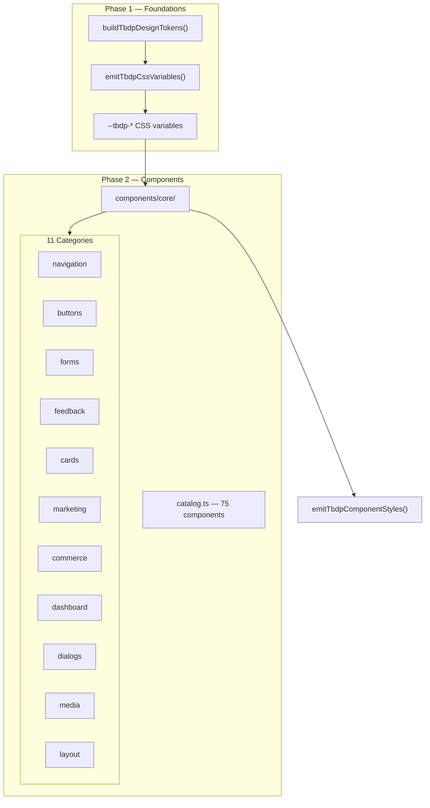

# TBDP Phase 2 — Component System Architecture

## Overview

Phase 2 builds the **Enterprise UI Component System** on top of Phase 1 foundations. All components consume TBDP CSS variables exclusively — no hardcoded design values.

## Architecture Diagram



## Component Module Structure

Every component follows this structure:

```
components/{category}/{id}/
├── index.ts           # Public exports
├── component.tsx      # React implementation
├── types.ts           # TypeScript props
├── variants.ts        # Visual variants (token refs)
├── tokens.ts          # Component-level token map
├── accessibility.ts   # WCAG AA ARIA config
├── documentation.md   # Usage examples
└── tests/
    └── {id}.test.tsx  # Render + structure tests
```

## Design Rules

1. **Token-only styling** — use `v.color.primary` or `var(--tbdp-color-primary)`
2. **data-tbdp-ui** — root marker on all components
3. **data-tbdp-component** — component identifier
4. **RTL/LTR** — via `dir` prop
5. **WCAG AA** — role, aria-*, focus rings

## Isolation

Phase 2 does not modify Website Builder, V2 templates, or runtime products. Import via:

```ts
import { PrimaryButton, TBDP_COMPONENT_CATALOG } from "@/lib/design-platform/components";
```
