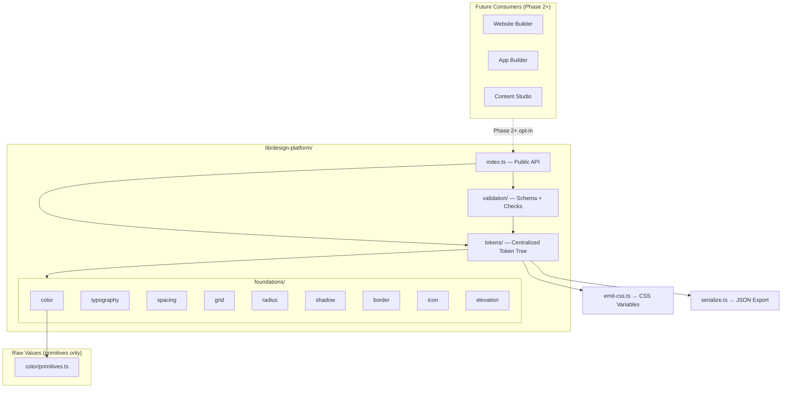

# TBDP Phase 1 — Architecture

Trend Business AI Design Platform (TBDP) is the **permanent design foundation** for all Trend Business AI products. Phase 1 delivers tokenized foundations only — no components, no UI library, no template coupling.

## Isolation Guarantees

| Boundary | Status |
|----------|--------|
| Website templates | **Not modified** |
| Template V2 engine | **Not modified** |
| Website Builder runtime | **Not modified** |
| Existing product imports | **Unchanged** |

TBDP lives exclusively under `lib/design-platform/` and is opt-in via explicit imports.

## Architecture Diagram



## Layer Model

1. **Primitives** — Literal values (hex, rem). Only in `color/primitives.ts`.
2. **Foundations** — Semantic definitions per domain (color, typography, spacing, …).
3. **Tokens** — Assembled `TbdpDesignTokens` tree via `buildTbdpDesignTokens()`.
4. **Emitters** — CSS variables and JSON serialization (framework agnostic).
5. **Validation** — Zod schema + structural checks.

## Data Flow

```
primitives → semantic mappings → buildTbdpDesignTokens() → validateTbdpFoundation()
                                                          → emitTbdpCssVariables()
                                                          → serializeTbdpTokens()
```

## Design Principles

- **Semantic-only consumption** — Products reference `--tbdp-color-primary`, never `#1A5CFF`.
- **Single source of truth** — No duplicated values across foundation modules.
- **Mode-aware** — Light and dark semantic color sets.
- **Locale-aware** — Latin/Arabic typography profiles with LTR/RTL direction.
- **Framework agnostic** — CSS custom properties and typed JSON; no React dependency.

## Versioning

| Constant | Value |
|----------|-------|
| `TBDP_SPEC_VERSION` | `1.0.0` |
| `TBDP_PHASE` | `foundations-1` |
| `TBDP_CSS_VAR_PREFIX` | `tbdp` |
