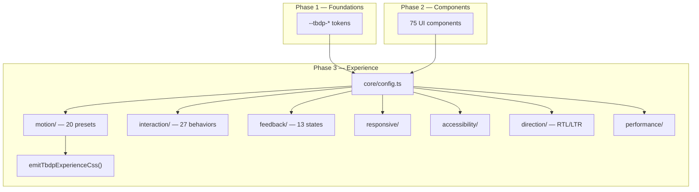

# TBDP Phase 3 — Experience System Architecture

## Overview

Phase 3 defines **how every TBDP interface feels, moves, responds, and behaves** — not animation alone, but the complete UX behavior layer.

Built exclusively on Phase 1 Foundations and Phase 2 Components. Fully isolated.

## Architecture Diagram



## Subsystems

| # | System | Module | Count |
|---|--------|--------|-------|
| 1 | Motion | `motion/` | 20 presets |
| 2 | Interaction | `interaction/` | 27 behaviors |
| 3 | Feedback | `feedback/` | 13 states |
| 4 | Responsive | `responsive/` | 6 viewport tiers |
| 5 | Accessibility | `accessibility/` | Focus, keyboard, ARIA |
| 6 | Direction | `direction/` | RTL/LTR rules |
| 7 | Performance | `performance/` | GPU budgets |

## Configuration

```ts
import { buildTbdpExperience, emitTbdpExperienceCss } from "@/lib/design-platform";

const xp = buildTbdpExperience({
  mode: "default",
  direction: "rtl",
  viewport: "mobile",
  prefersReducedMotion: false,
});

const css = emitTbdpExperienceCss();
```

## Data Attributes

- `data-tbdp-xp-motion="modal-enter"` — apply motion preset
- `data-tbdp-xp-feedback="loading"` — feedback state
- `data-tbdp-xp-touch="true"` — touch-optimized targets

## Reduced Motion

All motion respects `prefers-reduced-motion` and `mode: "reduced"`.
