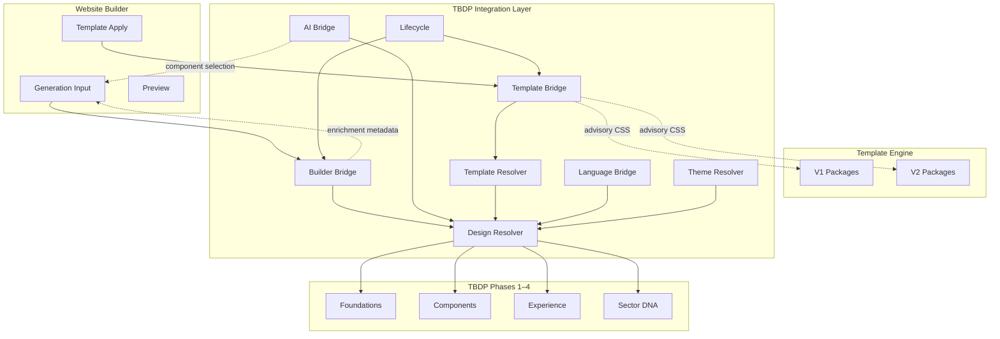

# Integration Diagram

## Data Flow

1. **Builder** calls `enrichBuilderInput()` — receives additive metadata
2. **AI** calls `resolveAiWebsiteDesign()` — sector DNA drives all selections
3. **Template apply** calls `resolveTemplateBridge()` — advisory TBDP CSS layer
4. **Design Context** is the single resolved object across all bridges
