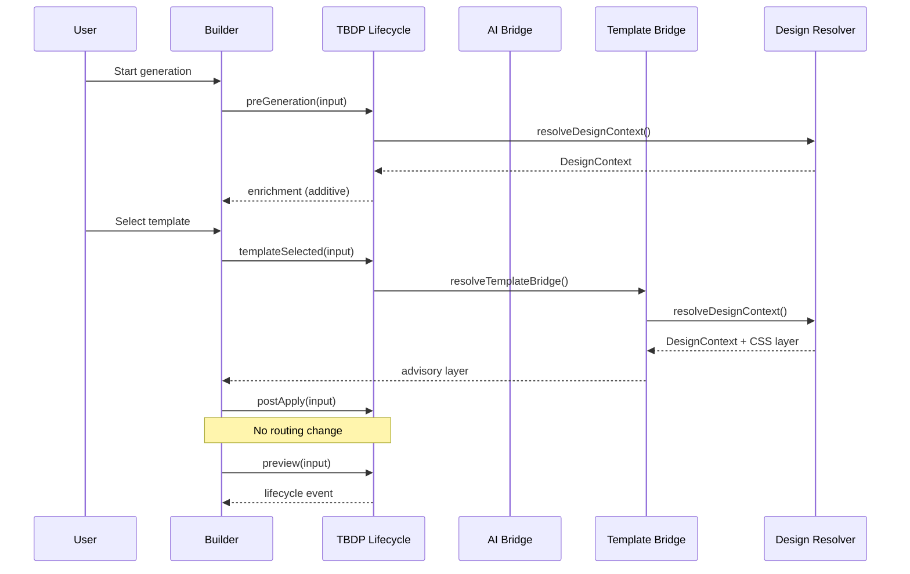

# Lifecycle Diagram

## Phases

| Phase | Hook | Effect |
|-------|------|--------|
| `pre-generation` | `tbdpBuilderLifecycle.preGeneration()` | Enrich input with sector DNA metadata |
| `template-selected` | `tbdpBuilderLifecycle.templateSelected()` | Resolve template + TBDP advisory layer |
| `post-apply` | `tbdpBuilderLifecycle.postApply()` | Emit lifecycle event only |
| `preview` | `tbdpBuilderLifecycle.preview()` | Emit lifecycle event only |

All hooks are **opt-in**. Builder behavior is unchanged when hooks are not called.
