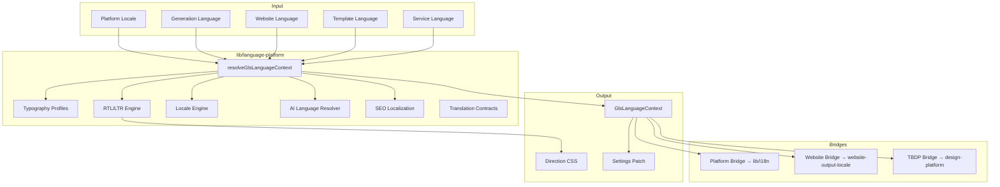

# Global Language System (GLS) — Architecture

**Package:** `lib/language-platform/`  
**Version:** 1.0.0  
**Phase:** gls-1

## Overview

GLS is the official centralized language architecture for Trend Business AI. It is **not** a translation module — it is the unified language platform consumed by every product.

## Architecture Diagram



## Folder Structure

```
lib/language-platform/
├── constants.ts
├── index.ts
├── lifecycle.ts
├── core/types.ts
├── context/resolve-context.ts
├── registry/
│   ├── languages.ts      # World language registry (30+ locales)
│   └── services.ts       # Service product registry
├── typography/
│   ├── profiles.ts       # Latin, Arabic, Hebrew, CJK, Cyrillic, Indic, Thai, Greek, Vietnamese
│   └── resolve.ts
├── direction/resolve.ts  # RTL/LTR engine
├── locale/resolve.ts     # Numbers, dates, currencies, pluralization
├── ai/resolve.ts         # AI language resolver
├── seo/resolve.ts        # hreflang, slugs, schema.org
├── translation/
│   ├── types.ts
│   └── validate.ts       # Contract validation, missing-key detection
├── bridges/
│   ├── platform-bridge.ts
│   ├── website-bridge.ts
│   └── tbdp-bridge.ts
├── validation/validate.ts
└── docs/
```

## Six Language Domains

| Domain | Scope | Source |
|--------|-------|--------|
| Platform Language | Dashboard, settings, nav, builder, editor, marketplace, docs | `lib/i18n/` via bridge |
| Generation Language | AI output during website/app/video/logo/brand generation | GLS AI resolver |
| Website Language | Generated site language, RTL, typography, locale | GLS + website bridge |
| Template Language | Language-neutral templates | `languageNeutral: true` |
| Service Language | Per-product independent selection | Service registry |
| Content Language | LLM-localized or static fallback packs | GLS AI resolver |

## Backward Compatibility

- **Additive only** — existing `lib/i18n/`, `website-output-locale`, TBDP `language-bridge` unchanged
- GLS bridges wrap existing primitives; no runtime mutations
- TBDP typography profiles mapped via `tbdpProfileId` for compatibility
- Project settings use new `gls*` keys alongside existing keys

## Verification

```bash
npm run test:language-platform
npm run verify:language-platform
```
