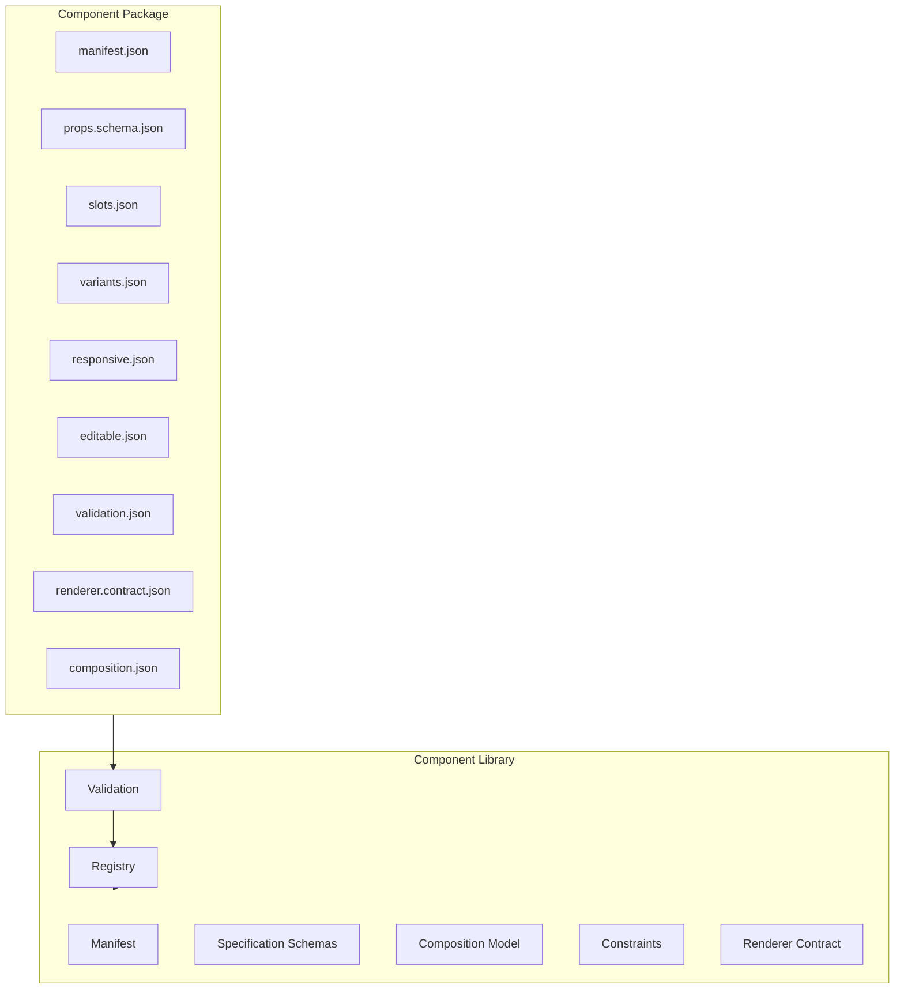

# Website Builder — Component Library Specification v1.0.0

**Composable · Capability-oriented · Business-agnostic**

## Philosophy

Components are **independent products** used by every Website Template. They are categorized by **capability**, not business type.

- No industry-specific hero variants (e.g. per vertical or business type)
- A **Hero** is a composable stack built from primitives: Heading, Text, Buttons, Image, Background
- Templates define **where** components may go (regions)
- AI or users define **what** components appear

---

## Architecture



---

## Folder structure

```
components/website/                    # Install root (empty initially)
└── <component-id>/
    ├── manifest.json
    ├── schemas/props.schema.json
    ├── slots/slots.json
    ├── variants/variants.json
    ├── responsive/responsive.json
    ├── editable/editable.json
    ├── validation/validation.json
    ├── contracts/renderer.contract.json
    └── composition/composition.json   # required when composable: true

lib/website/component-library/
├── index.ts
├── constants.ts
├── types.ts
├── categories.ts
├── capabilities.ts
├── composition.ts
├── constraints.ts
├── registry.ts
├── loader.ts
├── contracts/renderer.ts
└── spec/
    ├── COMPONENT_SPEC.md
    ├── schema.ts
    ├── validate-component.ts
    └── index.ts
```

---

## Component manifest (`manifest.json`)

| Field | Required | Description |
|-------|----------|-------------|
| `specVersion` | yes | Must be `1.0.0` |
| `id` | yes | kebab-case, matches folder name |
| `name` | yes | Display name |
| `category` | yes | Capability group (see below) |
| `capability` | yes | Fine-grained capability id |
| `version` | yes | Component semver |
| `description` | yes | Catalog description |
| `composable` | yes | Whether component accepts child slots |
| `primitive` | yes | Whether component is a leaf primitive |
| `propsSchema` | yes | `{ file }` path to props schema |
| `slots` | yes | `{ file }` path to slots document |
| `variants` | yes | `{ file }` path to variants |
| `responsive` | yes | `{ file }` path to responsive rules |
| `editableProperties` | yes | `{ file }` path to editor metadata |
| `validation` | yes | `{ file }` path to validation rules |
| `renderer` | yes | `{ contract, file }` renderer contract |
| `composition` | conditional | Required when `composable: true` |
| `constraints` | no | Additional constraint rules |
| `compatibility` | yes | Library + renderer contract version |
| `tags` | no | Search tags |

### Category groups (NOT business groups)

| Category | Purpose |
|----------|---------|
| `navigation` | Menus, links, breadcrumbs |
| `content` | Headings, text, lists, quotes |
| `media` | Image, video, gallery, background |
| `marketing` | Hero stack, CTA stack, banners |
| `commerce` | Pricing, product cards |
| `forms` | Inputs, buttons, form layouts |
| `social` | Social links, share bars |
| `interactive` | Accordion, tabs, modal, carousel |
| `layout` | Grid, stack, container |
| `utility` | Spacer, divider |
| `custom` | Extensions |

---

## Composition model

### Primitive components

Leaf nodes with no child slots. Examples: `heading`, `text`, `button`, `image`, `background`.

```json
{
  "composable": false,
  "primitive": true
}
```

### Composable components

Assembled from primitives via **named slots**. Example Hero:

```json
{
  "id": "hero",
  "slots": [
    { "id": "background", "kind": "optional", "accepts": ["background", "image"], "maxItems": 1 },
    { "id": "heading", "kind": "single", "accepts": ["heading"], "maxItems": 1 },
    { "id": "body", "kind": "single", "accepts": ["paragraph", "rich-text"], "maxItems": 1 },
    { "id": "actions", "kind": "collection", "accepts": ["button", "button-group"], "maxItems": 4 },
    { "id": "media", "kind": "optional", "accepts": ["image", "video"], "maxItems": 1 }
  ]
}
```

`composition.json` documents allowed children and an **example** tree — not hardcoded runtime content:

```json
{
  "id": "hero",
  "description": "Composable hero stack",
  "allowedChildCapabilities": ["heading", "paragraph", "button", "image", "background"],
  "example": [
    { "slotId": "background", "capability": "background" },
    { "slotId": "heading", "capability": "heading" },
    { "slotId": "body", "capability": "paragraph" },
    { "slotId": "actions", "capability": "button" }
  ]
}
```

---

## Slots

| Field | Description |
|-------|-------------|
| `id` | Slot name |
| `kind` | `single`, `collection`, `optional` |
| `accepts` | Allowed **capabilities** (not business types) |
| `acceptsComponents` | Optional explicit component id allow-list |
| `minItems` / `maxItems` | Collection bounds |
| `ordering` | `vertical`, `horizontal`, `grid`, `free` |
| `allowNesting` | Whether nested composition is permitted |

---

## Variants

Visual/structural variants without changing component identity:

```json
{
  "variants": [
    { "id": "centered", "style": "default", "default": true },
    { "id": "split", "style": "bold", "propOverrides": { "layout": "split" } }
  ]
}
```

---

## Responsive behavior

```json
{
  "rules": [
    { "breakpoint": "md", "mode": "stack", "target": "component" },
    { "breakpoint": "sm", "mode": "hide", "target": "slot", "slotId": "media" }
  ]
}
```

Modes: `stack`, `hide`, `collapse`, `reflow`, `scale`

---

## Editable properties

Editor metadata mapping props paths to UI controls:

```json
{
  "properties": [
    { "path": "props.heading", "label": "Heading", "kind": "text" },
    { "path": "props.align", "label": "Alignment", "kind": "alignment" }
  ]
}
```

---

## Validation model

1. **Schema validation** — Zod parses every document
2. **Id consistency** — all document `id` fields match manifest `id`
3. **Composable rules** — composable components require slots + composition doc
4. **Slot validation** — slot ids unique, acceptance capabilities valid
5. **Constraint validation** — constraint rules reference real slots/variants/props
6. **Composition validation** — example trees respect slot acceptance rules
7. **Renderer contract** — `componentId` matches manifest, `rootElement` required

---

## Renderer contract

Defines output agreement — **not** a connected renderer:

```json
{
  "contractVersion": "1.0.0",
  "componentId": "hero",
  "output": "abstract-tree",
  "rootElement": "section",
  "requiredAttributes": ["data-wb-component", "data-wb-component-id"],
  "slotRendering": "named-regions"
}
```

Future renderers produce either:
- `abstract-tree` — `WbComponentRenderTreeNode` (architecture default)
- `html-fragment` — sanitized HTML fragment

---

## Registry design

```typescript
getWbComponentRegistry()
  .register(pkg)
  .list()
  .listByCategory("marketing")
  .listByCapability("hero-stack")
  .getPackage("hero")
```

Loaded by `loadWbComponentPackages()` scanning `components/website/*`.

---

## Independence guarantees

This library does **NOT** import from:

- Theme System (`lib/website/builder/theme-*`)
- Template Engine UI / generation
- Smart Templates, Premium Templates, Template Intelligence
- `lib/ai-core/component-marketplace`

Templates may reference component **capabilities** in region placement rules. That integration is future work.

---

## Spec version

**Current:** `1.0.0` (`WB_COMPONENT_LIBRARY_SPEC_VERSION`)
