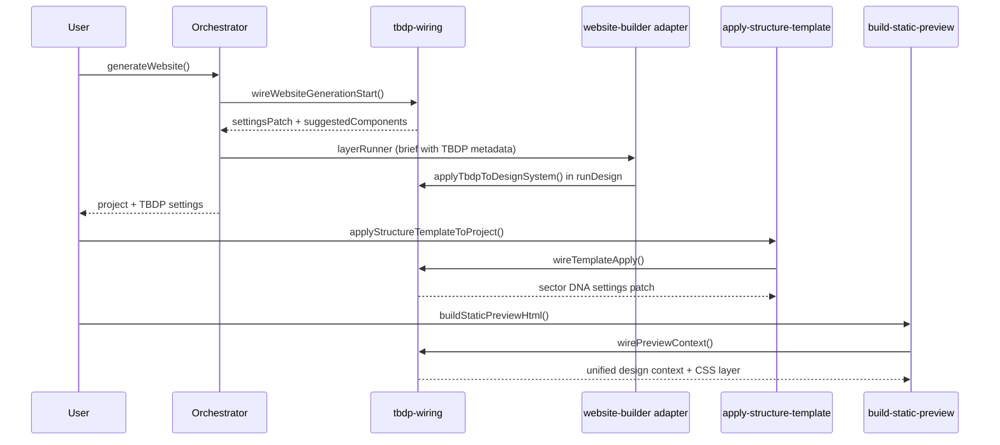

# Builder Lifecycle (Phase 6)

## Phases

| Phase | Hook | File |
|-------|------|------|
| Pre-generation | `wireWebsiteGenerationStart` | `orchestrator.ts` |
| Brief enrichment | `wireBriefMetadata` | `website-builder.ts` |
| Design | `applyTbdpToDesignSystem` | `website-builder.ts` |
| Template apply | `wireTemplateApply` | `apply-structure-template.ts` |
| Persist | `validateWebsiteAgainstTbdp` | `save-generation.ts` |
| Preview | `wirePreviewContext` | `build-static-preview.server.ts` |
