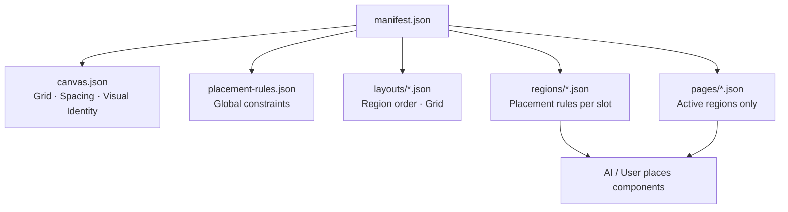

# Website Builder — Template Package Specification v2.0.0

**Layout-driven · Region-based · Content-agnostic**

## Philosophy

A template package defines **HOW** a website looks and behaves structurally.

It owns:

- Visual identity (colors, typography, radius, shadows, borders)
- Layout composition
- Regions (header, main, sidebar, footer, …)
- Grid and spacing
- Component **placement rules**
- Responsive behavior

A template package must **NOT** define business content. It must **NOT** hardcode:

- Hero, FAQ, Pricing, Team, Contact, Services, Testimonials, Blog, or any section

Every page is a **blueprint of regions**. The AI or user decides which **components** are placed inside each region at runtime.

---

## Installation

Copy a folder into:

```
templates/website/<package-id>/
```

- Folder name **must** match `manifest.id`
- Engine auto-discovers and validates on initialize
- No registry edits required

---

## Package layout

```
templates/website/<package-id>/
├── manifest.json
├── package.entry.json
├── canvas.json
├── placement-rules.json
├── component-types.json          # optional
├── assets/
│   ├── thumbnail.png
│   ├── preview.png
│   └── manifest.json             # optional
├── layouts/
│   └── default.json
├── regions/
│   ├── header.json
│   ├── main.json
│   └── footer.json
└── pages/
    └── home.json
```

---

## Architecture overview



---

## 1. Manifest (`manifest.json`)

| Field | Required | Description |
|-------|----------|-------------|
| `specVersion` | yes | Must be `2.0.0` |
| `id` | yes | kebab-case, matches folder name |
| `version` | yes | Package semver |
| `name` | yes | Display name |
| `description` | yes | Catalog description |
| `metadata` | yes | Category, tags, author |
| `media` | yes | Thumbnail + preview paths |
| `compatibility` | yes | Engine + spec version |
| `dependencies` | no | External packages / component libraries |
| `update` | yes | Release metadata |
| `responsive` | yes | Global breakpoints |
| `canvas` | yes | `{ "file": "canvas.json" }` |
| `placementRules` | yes | `{ "file": "placement-rules.json" }` |
| `componentTypes` | no | `{ "file": "component-types.json" }` |
| `layouts` | yes | Layout registry |
| `regions` | yes | Region registry |
| `pages` | yes | Page blueprint registry (must include `home`) |
| `assets` | no | Optional asset index |
| `entry` | yes | Path to `package.entry.json` |

### Removed from v1.0.0

| Removed | Reason |
|---------|--------|
| `sections` | Business content is runtime, not template |
| `blocks` | Replaced by component placement in regions |
| `dependencies.blocks` | Replaced by `dependencies.componentLibraries` |

---

## 2. Canvas model (`canvas.json`)

Defines the global **canvas architecture** — grid, spacing scale, and visual identity shell.

```json
{
  "id": "canvas",
  "grid": {
    "columns": 12,
    "gutter": "1.5rem",
    "margin": "1rem",
    "maxWidth": "72rem"
  },
  "spacing": {
    "unit": "rem",
    "scale": ["0.25", "0.5", "1", "1.5", "2", "3"]
  },
  "visualIdentity": {
    "colors": {
      "primary": "#c6a75e",
      "background": "#0b0b0f",
      "foreground": "#f5f5f7",
      "muted": "rgba(245,245,247,0.62)",
      "accent": "#c6a75e"
    },
    "typography": {
      "display": "Georgia, serif",
      "body": "Inter, sans-serif",
      "scale": { "sm": "0.875rem", "lg": "1.25rem" }
    },
    "radius": { "sm": "8px", "md": "16px", "lg": "24px" },
    "shadows": { "card": "0 8px 24px rgba(0,0,0,0.2)" },
    "borders": { "default": "rgba(255,255,255,0.08)" }
  }
}
```

---

## 3. Region model (`regions/<id>.json`)

A **region** is a structural slot on the page canvas — not business content.

```json
{
  "id": "main",
  "role": "main",
  "label": "Main Region",
  "layout": {
    "width": "contained",
    "alignment": "center",
    "maxWidth": "72rem",
    "padding": "1.5rem"
  },
  "placement": {
    "allowedComponentTypes": [
      "hero", "banner", "features", "gallery", "pricing",
      "faq", "team", "blog", "contact", "video", "timeline", "cta", "custom"
    ],
    "ordering": "vertical",
    "allowNesting": false,
    "maxComponents": 24,
    "minComponents": 0,
    "allowCustomComponents": true
  },
  "responsive": {
    "collapseBelow": "md",
    "stackOrder": "normal"
  }
}
```

### Region roles

`header` · `main` · `sidebar` · `footer` · `overlay` · `utility`

### Region layout

| Field | Values |
|-------|--------|
| `width` | `full`, `contained`, `narrow`, `wide` |
| `alignment` | `start`, `center`, `end`, `stretch` |

### Region placement rules

| Field | Description |
|-------|-------------|
| `allowedComponentTypes` | Component types permitted in this region |
| `ordering` | `vertical`, `horizontal`, `grid`, `free` |
| `allowNesting` | Whether components may nest |
| `maxComponents` | Upper bound on components in region |
| `minComponents` | Optional lower bound |
| `requiredTypes` | Types that must appear (validated at runtime) |
| `mutuallyExclusive` | Groups of types that cannot coexist |
| `allowCustomComponents` | Allow types outside the catalog |

---

## 4. Layout model (`layouts/<id>.json`)

Defines **region order** and grid — not content.

```json
{
  "id": "default",
  "kind": "single-column",
  "label": "Default Layout",
  "regionOrder": ["header", "main", "footer"],
  "rules": {
    "gap": "1.5rem",
    "regionGap": "1rem"
  },
  "grid": {
    "templateAreas": "\"header\" \"main\" \"footer\"",
    "columns": "1fr"
  }
}
```

**Layout kinds:** `single-column`, `sidebar-left`, `sidebar-right`, `full-bleed`

---

## 5. Page blueprint (`pages/<id>.json`)

Declares which regions are active on a page. **No components, no sections.**

```json
{
  "id": "home",
  "title": "Home",
  "path": "/",
  "layoutId": "default",
  "regions": ["header", "main", "footer"]
}
```

Rules:

- `regions` must be a subset of the layout's `regionOrder`
- Every region id must exist in `manifest.regions`
- Components are **not** listed here

---

## 6. Component placement model (`placement-rules.json`)

Global constraints applied across all pages and regions.

```json
{
  "global": {
    "maxComponentsPerPage": 48,
    "allowDuplicateTypes": true,
    "defaultOrdering": "vertical"
  },
  "regionOverrides": {
    "header": {
      "allowedComponentTypes": ["navigation", "logo", "cta"],
      "maxComponents": 4
    }
  },
  "constraints": [
    {
      "id": "no-pricing-in-header",
      "when": { "region": "header" },
      "deny": { "componentTypes": ["pricing"] }
    }
  ]
}
```

---

## 7. Component types catalog (`component-types.json`, optional)

Validates `allowedComponentTypes` when present.

```json
{
  "types": [
    { "id": "hero", "category": "content", "nestable": false },
    { "id": "pricing", "category": "commerce", "nestable": false },
    { "id": "custom", "category": "custom", "nestable": true }
  ]
}
```

**Known types:** `hero`, `banner`, `features`, `gallery`, `pricing`, `faq`, `team`, `blog`, `contact`, `video`, `timeline`, `cta`, `navigation`, `logo`, `testimonials`, `services`, `custom`

---

## 8. Entry descriptor (`package.entry.json`)

```json
{
  "defaultPageId": "home",
  "defaultLayoutId": "default"
}
```

---

## Validation (v2.0.0)

`validateWbTemplatePackage(dir)` checks:

1. Manifest schema (`specVersion` = `2.0.0`)
2. Folder name === `manifest.id`
3. Engine semver compatibility
4. Canvas, placement rules, layouts, regions, page blueprints exist and validate
5. Layout `regionOrder` references declared regions
6. Page `regions` ⊆ layout `regionOrder`
7. Region placement types ⊆ component catalog (when catalog present)
8. Placement rule overrides reference valid regions/pages
9. Media files exist

---

## Migration impact (v1.0.0 → v2.0.0)

| v1.0.0 | v2.0.0 |
|--------|--------|
| `sections/` directory | **Removed** — use region placement rules |
| `blocks/` directory | **Removed** — components are runtime |
| `manifest.sections` | **Removed** |
| `manifest.blocks` | **Removed** |
| Page `sections[]` slots | Page `regions[]` ids only |
| Layout `header/nav/footer` objects | **Removed** — header/footer are regions |
| `specVersion: "1.0.0"` | `specVersion: "2.0.0"` |
| Section-driven renderer | Region shell renderer (empty slots) |

**No production templates exist yet** — migration is a clean break with zero data migration required.

---

## Implementation

| Module | Path |
|--------|------|
| Spec version | `WB_TEMPLATE_PACKAGE_SPEC_VERSION = "2.0.0"` |
| Types | `lib/website/template-engine/spec/types.ts` |
| Schemas | `lib/website/template-engine/spec/schema.ts` |
| Validator | `lib/website/template-engine/spec/validate-package.ts` |
| Blueprint resolver | `lib/website/template-engine/spec/resolve-blueprint.ts` |

**Current spec version:** `2.0.0`
