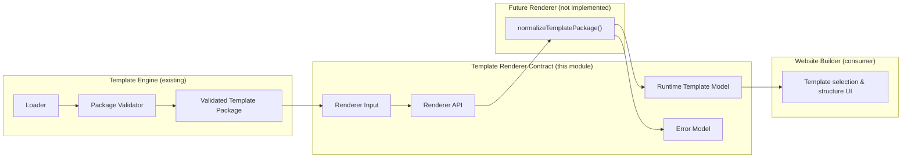

# Website Builder — Template Renderer Contract v1.0.0

**Contract-only · No rendering · Stable API**

## Purpose

The Template Renderer Contract defines the **stable boundary** between:

1. **Input** — a validated Template Package (produced by the Template Engine)
2. **Output** — a normalized **runtime Template Model** consumed by the Website Builder

This document and the companion TypeScript module (`lib/website/template-renderer-contract/`) establish the API **before any renderer implementation begins**.

> **This contract does not render anything.**  
> No HTML, CSS, React components, preview output, or editor behavior is produced here.

---

## Architecture



---

## 1. Renderer responsibilities

A conforming Template Renderer implementation **must**:

| # | Responsibility |
|---|----------------|
| 1 | Accept a **validated Template Package** as its only structural input |
| 2 | Normalize package documents into a **stable runtime Template Model** |
| 3 | Preserve layout, page, region, and placement semantics without altering meaning |
| 4 | Resolve **effective placement rules** per region (region document + global overrides) |
| 5 | Expose catalog **metadata** required by the Website Builder template picker |
| 6 | Return contract-conformant output **or** structured renderer errors |
| 7 | Validate its own output against the runtime model contract before returning |

---

## 2. Renderer inputs

### Primary input

```typescript
type WbTemplateRendererInput = {
  package: WbTemplateRendererPackageInput; // validated Template Package
  contractVersion?: string;               // defaults to "1.0.0"
  scope?: WbTemplateRendererScope;          // optional structural focus
};
```

### `package` — validated Template Package

The package **must already be validated** by `validateWbTemplatePackage()` / `loadValidatedWbTemplatePackage()` in the Template Engine.

Minimum requirements:

| Field | Required | Description |
|-------|----------|-------------|
| `manifest` | yes | Package identity, metadata, compatibility |
| `entry` | yes | Default page and layout ids |
| `canvas` | yes | Grid, spacing, visual identity shell |
| `placementRules` | yes | Global, override, and constraint rules |
| `layouts` | yes | At least one layout document |
| `regions` | yes | At least one region document |
| `pages` | yes | At least one page blueprint |
| `mediaPaths` | yes | Resolved thumbnail/preview paths |
| `loadedAt` | yes | Package load timestamp |
| `componentTypes` | no | Optional component type catalog |

**Minimum package spec version:** `2.0.0`

### `scope` — optional structural focus

```typescript
type WbTemplateRendererScope = {
  pageId?: string;
  layoutId?: string;
};
```

Scope is **structural only**. It may guide normalization focus but must **not** carry editor state, selection, themes, or user content.

### Input the renderer must reject

- Unvalidated or partially loaded packages
- Packages below spec version `2.0.0`
- Scope references to unknown pages or layouts
- Unsupported renderer contract versions

---

## 3. Renderer outputs

### Success output

```typescript
type WbTemplateRendererOutput = {
  model: WbTemplateRuntimeModel;
  meta: WbTemplateRendererMeta;
};
```

Wrapped in a result union:

```typescript
type WbTemplateRendererResult =
  | { ok: true; value: WbTemplateRendererOutput }
  | { ok: false; error: WbTemplateRendererFailure };
```

### Output metadata

```typescript
type WbTemplateRendererMeta = {
  contractVersion: string;
  templateId: string;
  templateVersion: string;
  packageSpecVersion: string;
  normalizedAt: string;       // ISO-8601
  scope?: WbTemplateRendererScope;
};
```

---

## 4. Runtime Template Model

The runtime model is the **normalized, builder-facing representation** of a Template Package.

### Top-level shape

```typescript
type WbTemplateRuntimeModel = {
  contractVersion: string;
  template: {
    id: string;
    version: string;
    name: string;
    description: string;
    specVersion: string;
  };
  metadata: WbTemplateRuntimeMetadata;
  entry: {
    defaultPageId: string;
    defaultLayoutId: string;
  };
  responsive: WbTemplateRuntimeResponsiveConfig;
  canvas: WbTemplateRuntimeCanvas;
  layouts: Record<string, WbTemplateRuntimeLayout>;
  regions: Record<string, WbTemplateRuntimeRegion>;
  pages: Record<string, WbTemplateRuntimePageDefinition>;
  placementRules: WbTemplateRuntimePlacementRules;
  componentTypes?: WbTemplateRuntimeComponentTypes;
  media: {
    thumbnail: string;
    preview: string;
    gallery: string[];
  };
};
```

### Layout

```typescript
type WbTemplateRuntimeLayout = {
  id: string;
  kind: "single-column" | "sidebar-left" | "sidebar-right" | "full-bleed";
  label?: string;
  description?: string;
  regionOrder: string[];
  rules?: { minHeight?: string; gap?: string; regionGap?: string };
  grid?: { templateAreas?: string; columns?: string; rows?: string };
};
```

### Region

```typescript
type WbTemplateRuntimeRegion = {
  id: string;
  role: "header" | "main" | "sidebar" | "footer" | "overlay" | "utility";
  label?: string;
  description?: string;
  layout: {
    width: "full" | "contained" | "narrow" | "wide";
    alignment: "start" | "center" | "end" | "stretch";
    maxWidth?: string;
    padding?: string;
    minHeight?: string;
  };
  placement: WbTemplateRuntimeRegionPlacement;
  responsive?: {
    collapseBelow?: string;
    stackOrder?: "normal" | "reverse";
    hideBelow?: string;
    fullWidthBelow?: string;
  };
};
```

### Page

```typescript
type WbTemplateRuntimePageDefinition = {
  id: string;
  title: string;
  path: string;
  layoutId: string;
  regionIds: string[];   // ordered subset of layout.regionOrder
  description?: string;
  optional?: boolean;
};
```

### Placement rules

```typescript
type WbTemplateRuntimePlacementRules = {
  global: {
    maxComponentsPerPage?: number;
    allowDuplicateTypes?: boolean;
    defaultOrdering?: "vertical" | "horizontal" | "grid" | "free";
  };
  regionOverrides?: Record<string, Partial<WbTemplateRuntimeRegionPlacement>>;
  constraints?: WbTemplateRuntimePlacementConstraint[];
};
```

### What the runtime model contains

| Domain | Included |
|--------|----------|
| Layouts | Yes — structure and region ordering |
| Pages | Yes — blueprints with layout + region references |
| Regions | Yes — roles, layout shell, placement rules |
| Placement rules | Yes — global, overrides, constraints |
| Metadata | Yes — catalog, author, tags, category |
| Canvas | Yes — grid, spacing, template visual identity tokens |
| Media refs | Yes — thumbnail/preview paths (not binary content) |
| Component types | Optional — when declared in package |

### What the runtime model must NOT contain

| Excluded | Reason |
|----------|--------|
| React components | Component Library responsibility |
| HTML / CSS strings | Preview / publish pipeline responsibility |
| Rendering logic | Renderer implementation detail |
| AI prompts or generated copy | AI layer responsibility |
| Theme tokens / brand overrides | Theme System responsibility |
| Editor state (selection, undo, drafts) | Editor responsibility |
| Placed component instances | Website Builder page state |
| Business/demo content | Not owned by templates |

---

## 5. Error model

### Structured issues

```typescript
type WbTemplateRendererIssue = {
  code: string;
  message: string;
  path?: string;
};
```

### Error class

```typescript
class WbTemplateRendererError extends Error {
  code: string;
  issues: WbTemplateRendererIssue[];
  path?: string;
}
```

### Stable error codes

| Code | When |
|------|------|
| `input.missing_package` | `input.package` absent |
| `input.invalid_package` | Package structurally incomplete |
| `input.unsupported_spec_version` | Package spec below `2.0.0` |
| `input.missing_page` | `scope.pageId` not found |
| `input.missing_layout` | `scope.layoutId` not found |
| `output.invalid_model` | Runtime model failed validation |
| `output.missing_field` | Required runtime model field absent |
| `output.invalid_reference` | Cross-reference points to unknown entity |
| `output.duplicate_id` | Duplicate layout/region/page id |
| `validation.layout_region_mismatch` | Layout references unknown region |
| `validation.page_layout_mismatch` | Page references unknown layout |
| `validation.page_region_mismatch` | Page region not in layout order |
| `validation.placement_override_unknown_region` | Override targets missing region |
| `validation.constraint_unknown_region` | Constraint targets missing region |
| `validation.constraint_unknown_page` | Constraint targets missing page |
| `contract.unsupported_version` | Renderer contract version mismatch |

### Failure result

```typescript
type WbTemplateRendererFailure = {
  code: string;
  message: string;
  issues: WbTemplateRendererIssue[];
};
```

Implementations should prefer `{ ok: false, error }` for recoverable failures and `WbTemplateRendererError` for exceptional paths.

---

## 6. Validation responsibilities

### Owned by this contract module

| Function | Purpose |
|----------|---------|
| `validateRendererInput()` | Structural completeness of renderer input |
| `assertRendererInput()` | Throw on invalid input |
| `validateRuntimeModel()` | Structural integrity of runtime output |
| `assertRuntimeModel()` | Throw on invalid output |
| `isWbTemplateRuntimeModel()` | Type guard |
| `assertRendererContractVersion()` | Reject unsupported contract versions |

Cross-reference checks performed on the runtime model:

1. Every `layout.regionOrder` entry exists in `regions`
2. Every `page.layoutId` exists in `layouts`
3. Every `page.regionIds` entry exists in `regions`
4. Every `page.regionIds` entry appears in the page's layout `regionOrder`
5. Every `placementRules.regionOverrides` key exists in `regions`
6. Every placement `constraint.when.region` / `when.page` references valid entities

### Owned by other systems

| System | Responsibility |
|--------|----------------|
| Template Engine validator | Package schema, file existence, semver compatibility |
| Template Loader | Filesystem discovery and registration |
| Component Library | Component package validation |
| Website Builder | Placed component instances and page content |
| Theme System | Brand/theme token resolution |
| Preview / Publish | HTML/CSS generation |

---

## 7. Explicit non-responsibilities

The Template Renderer Contract and any future renderer implementation **must not**:

1. Load packages from `templates/website/` (Template Loader)
2. Validate `manifest.json` against Zod schemas (Template Engine)
3. Import or render React components
4. Generate HTML, CSS, or preview documents
5. Apply themes or resolve brand styling
6. Invoke AI or generate business content
7. Read or write editor, autosave, or collaboration state
8. Persist websites or publish artifacts
9. Resolve runtime component trees inside region slots

---

## Renderer API signature

```typescript
type WbTemplateRenderer = (
  input: WbTemplateRendererInput,
) => WbTemplateRendererResult | Promise<WbTemplateRendererResult>;
```

No implementation is provided in this module. Future renderers must:

1. Call `assertRendererInput(input)` before normalization
2. Produce a `WbTemplateRuntimeModel`
3. Call `assertRuntimeModel(model)` before returning
4. Return `{ ok: true, value: { model, meta } }` on success

---

## Module layout

```
lib/website/template-renderer-contract/
├── TEMPLATE_RENDERER_CONTRACT.md   # This document
├── constants.ts                    # Contract version, error codes
├── types.ts                        # Input, output, runtime model types
├── errors.ts                       # Error class and issue helpers
├── validation.ts                   # Input/output contract validation
├── contract.ts                     # Responsibilities and API metadata
└── index.ts                        # Public exports
```

---

## Relationship to existing systems

| System | Relationship |
|--------|--------------|
| Template Engine | Produces validated input (`WbTemplateResolvedPackage`) |
| Template Loader | Discovers packages; renderer never touches filesystem |
| Template Packages | Source documents; renderer reads in-memory package only |
| Component Library | Parallel contract pattern; components are placed into regions later |
| Website Builder | Primary consumer of runtime Template Model |
| `template-engine/renderer.ts` | **Legacy structural HTML renderer — separate concern, not this contract** |

---

## Versioning

| Constant | Value |
|----------|-------|
| `WB_TEMPLATE_RENDERER_CONTRACT_VERSION` | `1.0.0` |
| `WB_TEMPLATE_RENDERER_MIN_PACKAGE_SPEC_VERSION` | `2.0.0` |

Breaking changes to input/output shapes require a contract version bump.

---

## Implementation status

| Item | Status |
|------|--------|
| Contract types | ✅ Defined |
| Error model | ✅ Defined |
| Input/output validation | ✅ Defined (no normalization) |
| Renderer implementation | ❌ Not started |
| Website Builder integration | ❌ Not started |

**Current contract version:** `1.0.0`
